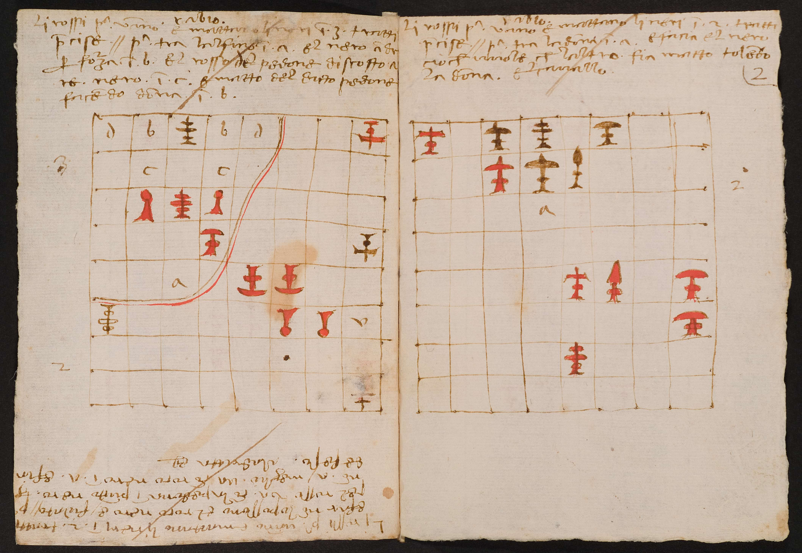

</img>

This is reproduction and extention of <a href="https://sites.google.com/view/puzzle-gen/overview">Generating Creative Chess Puzzles (Deepmind 2025)</a>

To create puzzles (originally they sampled 1 million, so try your luck with my models):
```bash
uv sync
. .venv/bin/activate
CUDA_VISIBLE_DEVICES=0 vllm serve reciprocate/chess-puzzle-4b-6m --served-model-name teacher --max-num-batched-tokens 32K --max-model-len 2048 --port 8000 &
CUDA_VISIBLE_DEVICES=1 vllm serve reciprocate/chess-4b-330m --served-model-name student --max-num-batched-tokens 32K --max-model-len 2048 --port 8001 --max-logprobs 200000 &
python interactive/create_puzzles.py
```
